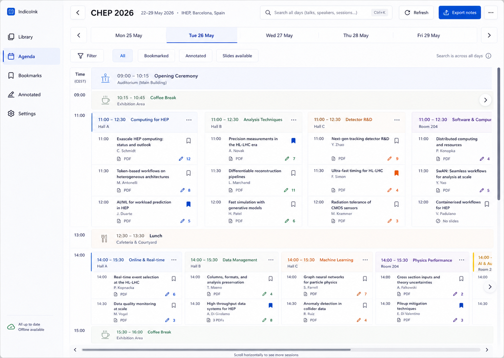

# IndicoInk V1 UX/UI Design

## 1. Design Intent

IndicoInk is a conference companion for quickly finding a talk, opening its
slides, and taking notes during a live presentation. The interface should feel
like a calm, modern Windows 11 application rather than a reproduction of the
Indico website.

The design prioritizes:

* Fast navigation with touch, pen, or mouse.
* A low-information default view with details available on demand.
* Clear spatial relationships between simultaneous conference sessions.
* Reliable visibility of bookmarks, slide materials, cached content, and
  annotations.
* An annotation experience in which the slides remain the visual focus.

Landscape is the primary layout. Portrait is fully supported and is especially
useful for viewing a continuous roll of slides.

## 2. Visual Reference

The V1 agenda direction is grounded by this generated mockup:

Use the mockup as the visual baseline for the Event Agenda: a calm Windows 11
surface, one day at a time, a shared two-dimensional canvas, session titles
inside scheduled blocks, spacious talk rows, bookmark controls, explicit slide
material states, and pencil-plus-number annotation counts.

The written design rules in this document remain authoritative where the mockup
is approximate. In particular, the target landscape density is roughly three
comfortable session columns at once, adjusted after testing against real
conference titles.

## 3. Application Structure

The application has three primary destinations:

1. **Library**: open a new Indico event or return to a previously opened event.
2. **Event agenda**: browse, search, and bookmark talks in an event.
3. **Slide notes**: view and annotate a selected PDF slide deck.

A compact navigation rail provides access to Library, Agenda, Bookmarks,
Annotated, and Settings. The rail may collapse to icons when space is limited.
The current event remains active when moving between Agenda, Bookmarks, and
Annotated.

Bookmarks and annotations are distinct:

* A **bookmark** marks a talk the user wants to find again.
* A **pencil icon with a number** shows how many slides in a talk contain
  annotations.

## 4. Conference Library

### 4.1 Layout

The Library opens with the app name and an event URL field as the primary
action. The field accepts a pasted or typed Indico event URL. A large **Open
event** button remains reachable by touch and is enabled when the URL is
plausible.

Previously opened events appear below as one grouped list, ordered by most
recently used. Each event row shows:

* Event title.
* Conference dates.
* Source host or shortened URL.
* Last opened time.
* Annotation summary, such as `12 annotated slides`.
* Offline/cached status when useful.
* A delete command in an overflow menu.

Selecting anywhere on an event row opens the event agenda. Rows are separated
with lightweight dividers rather than individual cards.

### 4.2 States

* **Empty library**: explain how to paste an Indico event URL; keep the URL
  field as the clear first action.
* **Loading event**: show fetch progress without blocking access to existing
  events.
* **Invalid or unreachable URL**: preserve the entered URL and show an inline
  error with a retry action.
* **Private event**: request an API key in a focused dialog.
* **Delete event**: use a confirmation dialog that explicitly states that
  cached slides and annotations will be deleted.

## 5. Event Agenda

### 5.1 Overall Layout

The Event Agenda uses a single, continuous two-dimensional canvas for one
conference day at a time:

* Vertical movement travels through time.
* Horizontal movement travels across simultaneous sessions.
* There are no independently scrolling session blocks.
* Switching days replaces the canvas while preserving the user's approximate
  time position when practical.

The screen contains:

1. A top command bar with Back, event title, search, refresh, and **Export
   notes**.
2. A day strip with previous/next controls and one button for each conference
   day.
3. A compact filter row.
4. The day canvas.
5. A shared horizontal scrollbar at the bottom of the canvas and a shared
   vertical scrollbar at the right.

Search operates across the entire event, not only the selected day. Opening a
search result switches to the correct day and brings the talk into view.

### 5.2 Day Canvas

The time gutter remains pinned to the left while the canvas moves horizontally.
Session headings belong to scheduled session blocks, not permanent all-day
track columns. This supports schedules in which the number and identity of
parallel sessions changes throughout the day.

Each scheduled session block contains:

* Session title.
* Session time range.
* Room or location.
* A short list of talks in chronological order.

Plenaries, ceremonies, breaks, lunch, and other shared agenda items span the
full available width.

The target landscape layout shows approximately three comfortable session
columns at once. Additional sessions are reached by horizontal scrolling. A
partially visible next column and a persistent horizontal scrollbar communicate
that more content is available.

The target portrait layout shows one full session column and part of the next
column. The time gutter remains visible.

Column widths are initially generous. They may be tightened after testing with
real conference titles, but titles should normally have room for two lines
without making talk rows feel compressed.

### 5.3 Talk Rows

Talk rows show only information needed while scanning:

* Start time.
* Talk title.
* Speaker.
* Bookmark toggle.
* Slide-material state.
* Annotated-slide count.

Room is inherited from the session heading unless it differs for the talk.
Additional metadata appears after selection rather than in every row.

Slide-material states use text plus an icon:

* **No slides**: no annotatable PDF is available.
* **PDF**: one annotatable PDF is available.
* **3 PDFs**: multiple annotatable PDFs are available.

The exact number is displayed for multiple PDFs. A talk with one PDF opens that
deck directly. A talk with multiple PDFs opens a material chooser and remembers
the selected default. A talk with no PDF may still open its details, but it
cannot enter the slide notes view.

A pencil icon followed by a number means the number of slides in the talk that
contain annotations. The accessible name and tooltip use explicit wording such
as `3 annotated slides`.

### 5.4 Agenda Actions

Selecting a talk opens a lightweight detail surface with full metadata,
materials, and a primary **Open slides** action. On a wide landscape layout this
may be a side pane. On portrait or narrow layouts it is a bottom sheet or
full-width overlay.

The filter row supports:

* All.
* Bookmarked.
* Annotated.
* Slides available.

Bookmarks and Annotated are also available as navigation destinations that
show results across all conference days.

### 5.5 Agenda Interaction

* Mouse wheel scrolls vertically.
* `Shift` plus mouse wheel scrolls horizontally.
* Trackpad gestures pan naturally in both axes.
* One-finger touch pans the canvas in both axes.
* Scrollbars and optional edge buttons provide explicit mouse and touch
  controls.
* Keyboard arrow keys move the canvas; Tab moves between interactive controls.
* Selecting a day preserves search and filter state.

## 6. Slide Notes

### 6.1 Layout

The Slide Notes view presents PDF pages as a continuous vertical roll. Slides
are centered and sized as large as practical without allowing surrounding
controls to compete with the document.

The screen contains:

* A compact top bar with Back to agenda, talk title, material selector when
  needed, slide position, and **Export notes**.
* A floating or compact annotation toolbar.
* The continuous slide roll.
* An optional slide navigator that can collapse when not needed.

Talk metadata is available from an information command rather than permanently
occupying vertical space.

### 6.2 Input Model

Input type determines behavior:

* **Pen/stylus** draws directly on the slide when the pen tool is active.
* **Finger touch** scrolls and pans; pinch zooms. Finger touch does not draw in
  V1.
* **Mouse** scrolls by default and draws when the pen tool is explicitly active.

The annotation toolbar contains Pen, Text, Eraser, Undo, and Redo. V1 uses
black pen strokes and black text. Controls use icons with tooltips and
accessible names.

Choosing Text changes the pointer or pen cursor to text placement mode. Clicking
with a mouse or tapping with a pen inserts an editable text note at that
location. Finger touch continues to navigate the slide viewer and does not
place annotations in V1. Selecting an existing text note allows it to be edited,
moved, or deleted.

### 6.3 Slide Navigation and Status

The viewer shows current slide and total slide count. The user can jump to a
slide number. The optional slide navigator marks annotated slides with the same
pencil indicator used in the agenda.

Leaving the viewer preserves:

* Scroll position.
* Zoom level.
* Selected deck.
* All annotations.

Saving is automatic and frequent. A subtle status label may briefly show
`Saving` and then `Saved`; it must not interrupt annotation.

## 7. Search

Agenda search accepts talk title, speaker, session, contribution ID, and
keywords. Results appear in a dedicated search surface rather than forcing the
user to inspect the spatial day canvas.

Each result shows title, speaker, session, day/time, bookmark state, material
state, and annotated-slide count. Selecting a result opens its details or
reveals it on the agenda canvas.

Search remains usable while agenda refresh is in progress.

## 8. Export

**Export notes** remains available from the Event Agenda and Slide Notes views.
It exports all annotated talks and slides in the current event; it does not
export only the currently visible talk.

Export uses a standard Windows save dialog. While rendering, a progress dialog
shows progress and allows cancellation. On completion, the app offers **Open
file location**.

If no slides are annotated, the app explains that there is nothing to export
and produces no file.

## 9. Responsive Behavior

### 9.1 Wide Landscape

* Expanded or compact navigation rail.
* Approximately three agenda session columns visible.
* Talk details may open in a side pane.
* Slide navigator may remain visible beside the document.

### 9.2 Narrow Landscape

* Icon-only navigation rail.
* Approximately two agenda session columns visible.
* Talk details overlay the canvas.
* Nonessential command labels collapse to icons.

### 9.3 Portrait

* Navigation rail becomes a compact top-level navigation control or overlay.
* One agenda session column plus a visible portion of the next is shown.
* Talk details use a bottom sheet or full-screen surface.
* Slides use most of the screen width, allowing several pages to be visible in
  the continuous roll.
* Annotation tools remain reachable near the screen edge without covering the
  active pen area.

## 10. Feedback and Exceptional States

The interface distinguishes:

* **Available online** from **cached for offline use**.
* **Refreshing** from **refresh failed**.
* **No slides** from **unsupported non-PDF materials**.
* **No annotations** from **annotated slides**.
* **Agenda item removed or changed upstream** from ordinary agenda items.

Status is never communicated by color alone. Use an icon and short text label
where the distinction matters.

When a slide deck has changed upstream and annotations exist, use a blocking
decision dialog that clearly describes the consequences before replacing the
cached deck.

## 11. Accessibility

* All interactive targets are at least 44 by 44 CSS pixels; 48 by 48 is the
  preferred target.
* Every icon-only control has an accessible name and tooltip.
* Focus indicators remain visible on every surface.
* Text, icons, and status indicators meet WCAG AA contrast.
* Bookmarks, material states, annotation counts, and cache states do not rely
  on color alone.
* The agenda remains operable by keyboard and screen reader despite its
  two-dimensional layout.
* Motion is restrained and respects reduced-motion preferences.

## 12. Validation Items

The following decisions are intentionally provisional and should be validated
with real conference data:

* Session-column width and whether approximately three columns is the best
  landscape default.
* Maximum useful title length before truncation or expansion.
* The best placement of annotation tools in portrait mode.
* Whether talk details are needed before opening a single PDF.
* Performance and orientation cues when a day contains ten or more possible
  session positions but fewer sessions run simultaneously.
